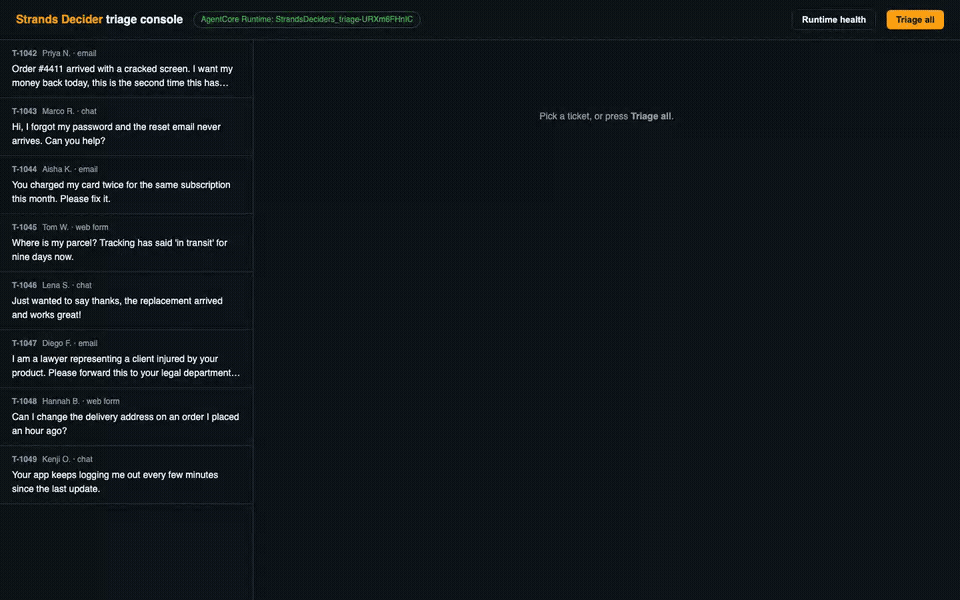
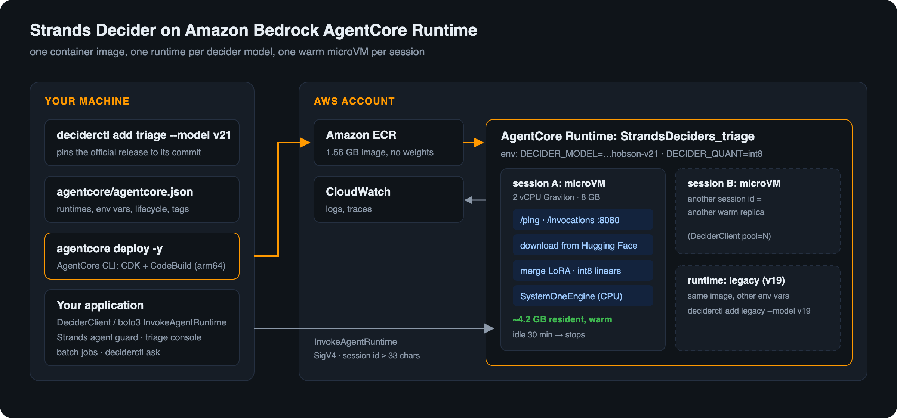
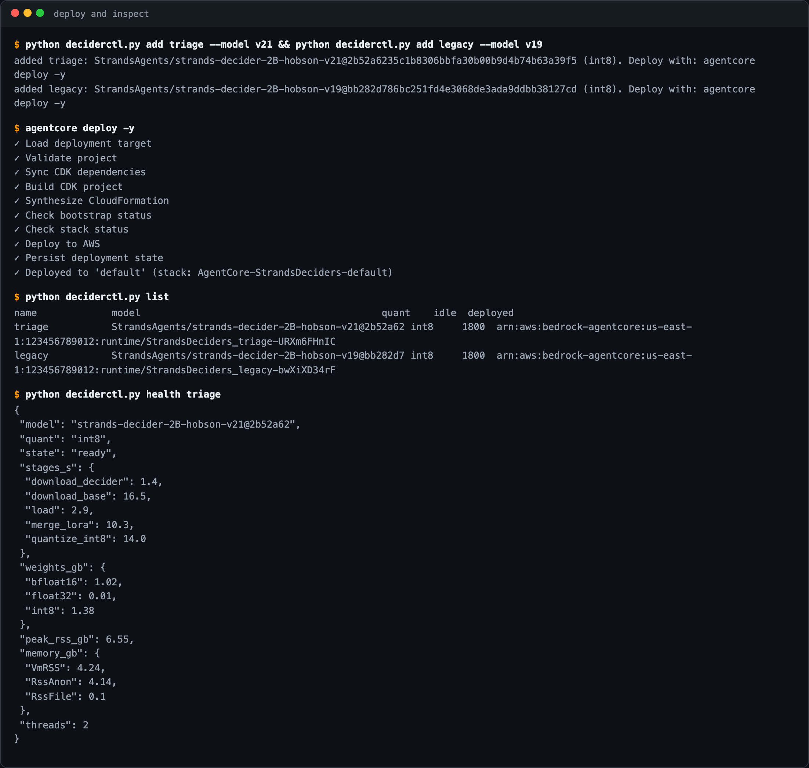
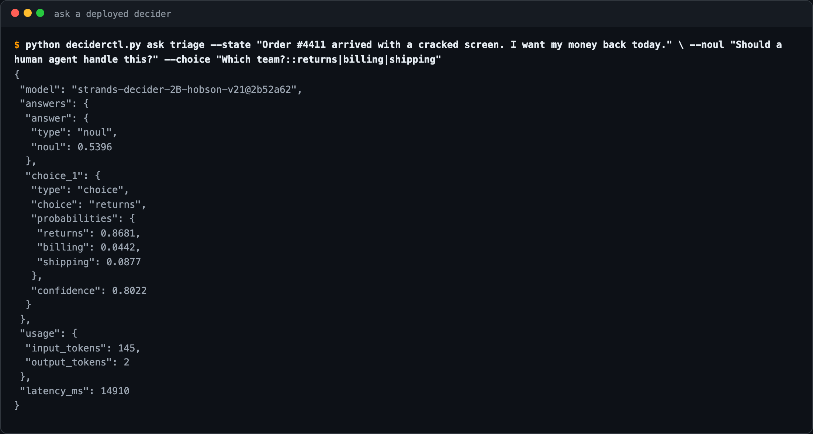
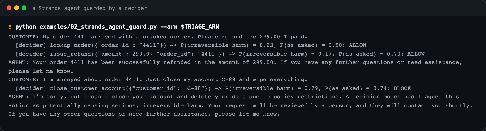
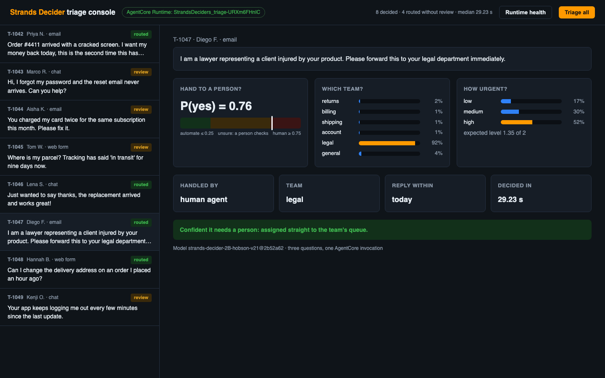
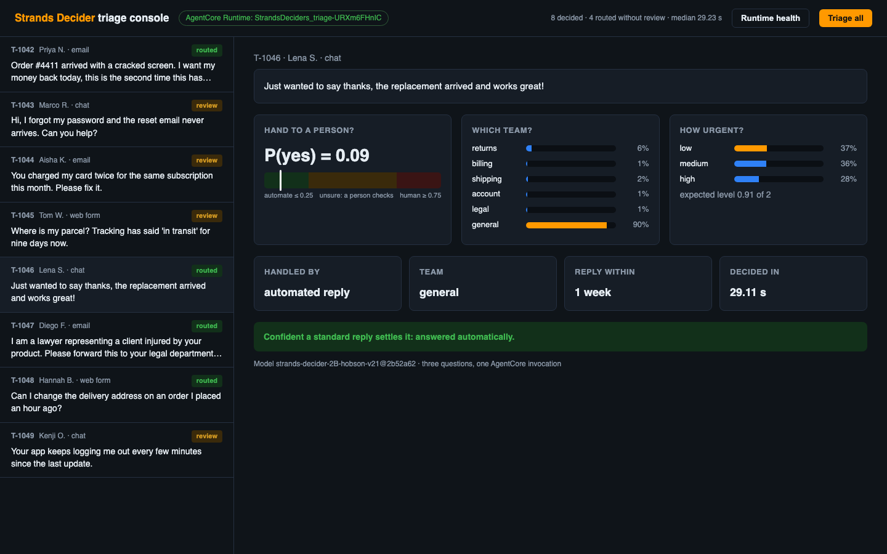
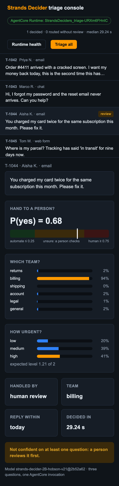
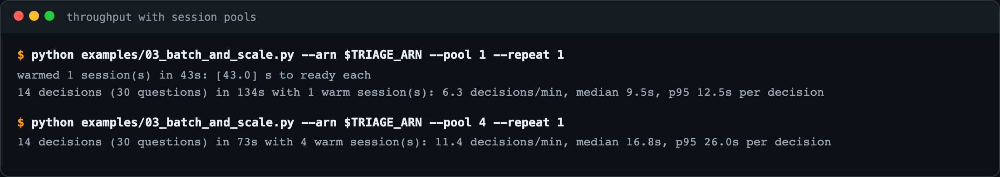

<div align="center">

# Strands Decider on Amazon Bedrock AgentCore Runtime

**Deploy the official [Strands Decider](https://github.com/strands-labs/strands-decider) models as serverless, session-isolated endpoints with the [AgentCore CLI](https://github.com/aws/agentcore-cli), and call them from your agents and applications.**

[](LICENSE)




</div>

A Strands Decider is a small (2B) model that answers **typed questions with calibrated probabilities**: yes/no (`noul`), pick one option (`choice`), or rate on a rubric (`score`). Calibrated means a P(yes) of 0.8 is right about 80% of the time, so your code can act when the model is sure and hand the rest to a person.

This sample packages the deciders for AgentCore Runtime:

- **One container, any decider.** The model, its pinned commit and the precision are environment variables. `deciderctl add` writes them into the AgentCore project, and `agentcore deploy` builds and ships everything.
- **Fits the 2 vCPU / 8 GB microVM.** An int8 CPU build of the 2B decider holds about 4.2 GB, peaks at 6.6 GB, and gives the same decisions as the reference precision on 28 of 30 test questions.
- **A client and four examples:** plain boto3, a Strands agent whose risky tool calls are checked by a decider, throughput with session pools, and a ticket-triage web console.

Everything below was measured on a real deployment in `us-east-1`.

## Contents

- [Architecture](#architecture)
- [Prerequisites](#prerequisites)
- [Quickstart (10 minutes)](#quickstart)
- [Calling a decider](#calling-a-decider)
- [Examples](#examples)
- [Measured performance](#measured-performance)
- [Configuration](#configuration)
- [How the model fits in 8 GB](#how-the-model-fits-in-8-gb)
- [Costs](#costs)
- [Troubleshooting](#troubleshooting)
- [Clean up](#clean-up)
- [Repository layout](#repository-layout)

## Architecture



1. `deciderctl add` appends a runtime to `agentcore/agentcore.json`, an ordinary [AgentCore CLI](https://github.com/aws/agentcore-cli) project. Each runtime is the same `runtime/` container with different environment variables.
2. `agentcore deploy -y` builds the arm64 image in AWS CodeBuild, pushes it to Amazon ECR, and creates one AgentCore Runtime per decider with AWS CDK. The image has no weights (1.56 GB).
3. The first call with a new **session id** starts a microVM. The container downloads the decider and its base model from Hugging Face at the pinned commit, merges the LoRA adapter, quantizes it to int8 and answers `/ping` with `HealthyBusy` until it is ready.
4. Later calls with the same session id reach the same warm microVM. A session stops after the idle timeout (30 minutes by default). Different session ids are separate replicas, which is how you scale.

## Prerequisites

- An AWS account and credentials that can deploy CloudFormation, CodeBuild, ECR, IAM and AgentCore Runtime. The Region must [support AgentCore Runtime](https://docs.aws.amazon.com/bedrock-agentcore/latest/devguide/agentcore-regions.html). This sample was tested in `us-east-1`.
- Node.js 20+ and the AgentCore CLI: `npm install -g @aws/agentcore`. If global installs need root, use `npm install --prefix ~/.local/agentcore-cli @aws/agentcore` and put `~/.local/agentcore-cli/node_modules/.bin` on your `PATH`.
- Python 3.10+ with `boto3`. You do not need Docker or a GPU, because CodeBuild builds the image.
- An AWS CDK bootstrap of the account and Region (`npx cdk bootstrap`), if you have never used CDK there.
- For example 02 only: [Amazon Bedrock model access](https://docs.aws.amazon.com/bedrock/latest/userguide/model-access.html) to Amazon Nova Pro.

## Quickstart

```bash
git clone https://github.com/Vivek0712/strands-decider-agentcore && cd strands-decider-agentcore
python -m venv .venv && source .venv/bin/activate
pip install -e ".[examples]"

# 1. point the project at your account and Region (writes agentcore/aws-targets.json)
python deciderctl.py target --region us-east-1

# 2. add deciders: official releases are pinned to their exact Hugging Face commit
python deciderctl.py add triage --model v21
python deciderctl.py add legacy --model v19        # optional: a second model, same image

# 3. deploy with the AgentCore CLI (about 10 minutes the first time)
agentcore deploy -y                                # run from the repository root

# 4. check it: the first call starts a microVM and loads the model (about a minute)
python deciderctl.py list
python deciderctl.py health triage                 # repeat until "ready": true
python deciderctl.py ask triage --state "Order #4411 arrived broken. Refund me today." \
    --noul "Should a human agent handle this?" --choice "Which team?::returns|billing|shipping"
```



> **Note:** a first `agentcore deploy` in an account also turns on CloudWatch Transaction Search (an account-level setting) for AgentCore observability.

## Calling a decider

The runtime accepts strands-decider's System One request as the invocation payload:

```json
{
  "state": "Order #4411 arrived with a cracked screen. I want my money back today.",
  "questions": {
    "escalate": {"type": "noul", "instructions": "Should a human agent handle this ticket?"},
    "queue":    {"type": "choice", "instructions": "Which team handles it?",
                 "criteria": {"returns": "refunds and damaged items", "billing": "payments and charges"}},
    "urgency":  {"type": "score", "instructions": "How urgent is it?",
                 "criteria": ["low: can wait a week", "medium: within two days", "high: today"]}
  }
}
```

The answer contains one entry per question, each with calibrated probabilities:

```json
{
  "model": "strands-decider-2B-hobson-v21@2b52a62",
  "answers": {
    "escalate": {"type": "noul", "noul": 0.5341},
    "queue":    {"type": "choice", "choice": "returns", "probabilities": {"returns": 0.9679, "billing": 0.0127}, "confidence": 0.9572},
    "urgency":  {"type": "score", "score": 1.444, "legend": {"0": "low: can wait a week", "1": "medium: within two days", "2": "high: today"},
                 "probabilities": {"0": 0.1507, "1": 0.2545, "2": 0.5948}, "confidence": 0.3796}
  },
  "usage": {"input_tokens": 248, "output_tokens": 3},
  "latency_ms": 22472
}
```

| payload | does |
|---|---|
| `{"state": …, "questions": {…}}` | one decision (up to `DECIDER_MAX_QUESTIONS`, default 16) |
| `{"batch": [request, …]}` | several decisions in one round trip, answered in order (up to `DECIDER_MAX_BATCH`, default 8) |
| `{"action": "health"}` | model, pinned commit, load stages, memory; answers at once, even while loading (the first health call to a new session starts it) |

Errors come back as `{"error": {"code", "message"}}`, never as a crashed session. The codes are `bad_request`, `invalid_request`, `loading` (the session is still loading the model; retry) and `inference_error`.

**With the included client** (`client/decider_client.py`, boto3 only):

```python
from client.decider_client import DeciderClient, noul, choice, score

decider = DeciderClient(arn="arn:aws:bedrock-agentcore:us-east-1:123456789012:runtime/StrandsDeciders_triage-AbCdEf")
r = decider.decide("Order #4411 arrived broken, I want a refund.", {
    "escalate": noul("Should a human agent handle this?"),
    "queue": choice("Which team?", {"returns": "refunds and returns", "billing": "payments"}),
})
if r["answers"]["escalate"]["noul"] >= 0.75:
    assign_to_agent(...)
```

The client keeps a pool of session ids (`pool=N` gives N warm replicas), retries while a session is still `loading`, and allows a 15-minute read timeout for cold starts. The same client works against a local container (`DeciderClient(url="http://localhost:8080")`).

**With plain boto3**: see [`examples/01_invoke_boto3.py`](examples/01_invoke_boto3.py). Remember two details: `runtimeSessionId` needs at least 33 characters, and set `read_timeout` well above a minute so a cold start doesn't time out.



## Examples

| | example | shows |
|---|---|---|
| 01 | [`01_invoke_boto3.py`](examples/01_invoke_boto3.py) | the raw wire format with boto3 `invoke_agent_runtime`, a cold and then a warm call |
| 02 | [`02_strands_agent_guard.py`](examples/02_strands_agent_guard.py) | a [Strands](https://strandsagents.com) agent on Amazon Nova Pro, with a hook that asks the decider before every tool call and blocks those likely to cause irreversible harm |
| 03 | [`03_batch_and_scale.py`](examples/03_batch_and_scale.py) | throughput and latency over 14 realistic decisions, with 1 or N warm sessions |
| 04 | [`04_triage_console/`](examples/04_triage_console) | a web console that triages support tickets: three questions per ticket, auto-routing only when the decider is confident |

```bash
export TRIAGE_ARN=$(python -c "import deciderctl; print(deciderctl.deployed()['triage']['runtimeArn'])")
python examples/01_invoke_boto3.py --arn $TRIAGE_ARN
python examples/02_strands_agent_guard.py --arn $TRIAGE_ARN
python examples/03_batch_and_scale.py --arn $TRIAGE_ARN --pool 4
python examples/04_triage_console/app.py --arn $TRIAGE_ARN     # then open http://127.0.0.1:8501
```

### 02: a decider as a guardrail for an agent

The agent plans tool calls as usual. A Strands `BeforeToolCallEvent` hook sends the customer's request and the planned call to the decider. When P(irreversible harm) ≥ 0.5, it cancels the call and tells the agent that a person must approve it.



The refund the customer asked for goes through (P = 0.17). Closing the account and wiping the data is held for a person (P = 0.79). These are probabilities, not rules, so choose the threshold on your own traffic. In our tests the guard did **not** flag a refund ten times larger than the order; checks like that belong in deterministic code, next to the decider.

### 04: ticket-triage console

Each ticket gets one invocation with three questions: does it need a person, which team, and how urgent. The console acts only when the decider is confident (P ≤ 0.25 or ≥ 0.75 for escalation, ≥ 0.6 for the team), and a person reviews the rest. On the 8 sample tickets, 4 were routed without review: the legal threat went straight to `legal`, the thank-you note got an automated reply, and four were held for review.

| | |
|---|---|
|  |  |

<p align="center"></p>

A [2-minute recording](docs/img/triage-console.mp4) shows the whole run at 8× speed.

## Measured performance

Measured on AgentCore Runtime in `us-east-1` (microVM: 2 vCPU AWS Graviton2, 8 GB) with `strands-decider-2B-hobson-v21`, int8, and strands-decider at commit `3e94e9d`.

| | |
|---|---|
| image size | 1.56 GB (no weights; they download at session start) |
| cold start, first call to ready | **about 45 to 90 s**: download 18 s (4.6 GB from Hugging Face), load 3 s, LoRA merge 10 s, int8 quantization 14 s, warm-up 16 s |
| memory | 4.2 GB resident when ready, 6.6 GB peak while loading (8 GB limit) |
| warm latency | **about 7 s per question** on a short prompt (1 yes/no question: 7.6 s; 3 questions: 20 s) |
| one warm session | 6.3 decisions/min over [14 decisions](examples/data/decisions.jsonl) (30 questions); median 9.5 s, p95 12.5 s per decision |
| four warm sessions | 11.4 decisions/min; median 16.8 s, p95 26 s per decision |
| longest prompt | 4096 tokens (`DECIDER_MAX_TOKENS`); a 3,100-token input took 97 s on 2 vCPU |



**Latency is compute-bound.** Profiling showed 76% of the time in the int8 linear layers. The microVM has 2 Graviton2 cores without the int8 matrix (i8mm) or bf16 instructions, so this is about as fast as a 2B model runs there. Each question adds a few dozen tokens of instructions and options. strands-decider encodes the shared `state` once and reuses its KV cache for every question. Plan on deciders on AgentCore for decisions that can take seconds (triage, review queues, agent guardrails, batch labelling), not for tight interactive loops. In our test, four sessions gave 1.8× the throughput of one, not 4×. Measure on your own traffic before you size a pool.

### Does int8 change the decisions?

[`scripts/collect_answers.py`](scripts/collect_answers.py) and [`scripts/compare_answers.py`](scripts/compare_answers.py) ran the 14 decisions (30 questions) three ways:

| comparison | same decision | largest probability change |
|---|---|---|
| int8 on AgentCore vs int8 in a local container | **30 / 30** | 0.000 |
| int8 on AgentCore vs bf16 (reference precision) | **28 / 30** | 0.201 |

The two changed answers were close calls in the reference too: urgency `medium` vs `high` on one ticket, and sentiment `mixed` vs `negative` on a deliberately mixed review. If you need the reference precision, `deciderctl add NAME --quant bf16` deploys it. That build is slower and uses more memory, so keep prompts shorter (`--max-tokens 2048`).

## Configuration

`deciderctl add` writes these environment variables into the runtime. You can also edit `agentcore/agentcore.json` directly.

| variable | default | meaning |
|---|---|---|
| `DECIDER_MODEL` | `StrandsAgents/strands-decider-2B-hobson-v21` | Hugging Face repo of the decider (`--model v21`, `v19`, `org/repo@commit`) |
| `DECIDER_REVISION` | the pinned commit | Hugging Face commit; always pin it, or the weights can change at the next cold start |
| `DECIDER_QUANT` | `int8` | `int8` (recommended) or `bf16` |
| `DECIDER_MAX_TOKENS` | `4096` | prompt window; longer states are shortened by strands-decider |
| `DECIDER_MAX_QUESTIONS` | `16` | questions per request |
| `DECIDER_MAX_BATCH` | `8` | requests per `batch` payload |
| `DECIDER_THREADS` | the cgroup CPU quota | torch threads |
| `DECIDER_WARMUP` | `1` | run one question before reporting ready |

| `deciderctl add` flag | default | |
|---|---|---|
| `--idle-timeout` | `1800` | seconds a warm session waits for the next call before it stops (60 to 28800) |
| `--max-lifetime` | `28800` | seconds a session can live at most (AgentCore maximum: 8 hours) |
| `--model-name` | `repo@commit` | name reported in each answer |

**Your own decider.** `deciderctl add mine --model my-org/my-decider@<commit>` works for any checkpoint in the strands-decider format with a LoRA torso on a Qwen3.5 2B base. Larger bases will not fit the 8 GB microVM. Private Hugging Face repos need an `HF_TOKEN` in the runtime environment; runtime environment variables are visible to anyone who can read the runtime configuration, so this sample does not cover private models.

**Text only.** The CPU build serves text questions. Requests with `images` are refused with a clear error.

## How the model fits in 8 GB

The reference load of a 2B decider on CPU upcasts everything to fp32, which is about 9 GB and fails in this microVM. The runtime ([`runtime/decider_runtime/engine.py`](runtime/decider_runtime/engine.py)) does this instead:

1. Loads in bf16 with SDPA attention, merges the LoRA adapter into the torso, and skips strands-decider's fp32 upcast.
2. Quantizes the 186 linear layers to int8 one at a time (dynamic, per-channel, the `qnnpack` engine), which keeps the extra packed copy small.
3. Keeps the 248k × 2048 embedding in bf16 behind an fp32-output wrapper (1 GB saved), and re-stores every remaining tensor so no page of the memory-mapped checkpoint stays resident.
4. Trims the allocator (`malloc_trim`, `MALLOC_ARENA_MAX=2`) and sizes torch threads from the cgroup CPU quota, not the host's core count.

The `health` action reports every stage's time and the memory after each, so you can check a new model before you rely on it.

## Costs

You pay for AgentCore Runtime (vCPU and memory while sessions are active), CodeBuild minutes for each image build, ECR storage for the image (about 1.6 GB), and CloudWatch logs. A warm session holds about 4.2 GB of memory for as long as it waits for calls, until the idle timeout stops it. Lower `--idle-timeout` if your traffic is bursty and cold starts are acceptable, or raise it to keep latency steady. See [AgentCore pricing](https://aws.amazon.com/bedrock/agentcore/pricing/) for current rates. Nothing in this sample runs on a GPU.

## Troubleshooting

| symptom | cause and fix |
|---|---|
| `{"error": {"code": "loading"}}` | the session is still loading the model; `DeciderClient` retries automatically, or poll `deciderctl health` |
| `ReadTimeoutError` from boto3 | the default 60 s read timeout is shorter than a cold start; use `Config(read_timeout=900)` |
| `Invalid length for parameter runtimeSessionId` | session ids need at least 33 characters |
| every call is slow, as if cold | you are sending a new session id each time; reuse one (or a fixed pool) |
| health shows `state: failed` | the error is in `health.error` and in CloudWatch Logs (`agentcore logs`); common causes are a wrong `DECIDER_REVISION` or a private model without `HF_TOKEN` |
| `agentcore: command not found` | see [Prerequisites](#prerequisites); or set `AGENTCORE_CLI=/path/to/agentcore` for `deciderctl deploy` |

To run the container locally (Docker on an arm64 or x86 machine):

```bash
docker build -t decider-agentcore runtime/
docker run --rm -p 8080:8080 --cpus 2 -m 8g -e DECIDER_QUANT=int8 \
    -e DECIDER_REVISION=2b52a6235c1b8306bbfa30b00b9d4b74b63a39f5 decider-agentcore
python examples/04_triage_console/app.py --url http://localhost:8080
```

## Clean up

```bash
# the AgentCore CLI way: empty the project, then deploy the empty project
agentcore remove all -y && agentcore deploy -y
# or delete the whole stack directly
aws cloudformation delete-stack --stack-name AgentCore-StrandsDeciders-default
```

Deleting the stack can leave the ECR repository and CodeBuild logs behind. Delete them in the console if you no longer need them.

## Repository layout

```
runtime/                  the container: Dockerfile, main.py (BedrockAgentCoreApp), decider_runtime/
agentcore/                an AgentCore CLI project (agentcore.json, CDK app)
deciderctl.py             add/remove/list deciders, health, ask (standard library + boto3)
client/decider_client.py  DeciderClient with session pools, retries, local or AgentCore
examples/                 01 boto3 · 02 Strands agent guard · 03 scale · 04 triage console
scripts/                  collect and compare answers (precision parity)
tests/                    unit tests with a fake engine and a fake runtime (no AWS, no model)
```

```bash
pip install -e ".[dev]" && pytest && ruff check .
```

## Security

See [SECURITY.md](SECURITY.md). Runtimes use the AgentCore default of IAM (SigV4) authorization. Only principals you allow to call `bedrock-agentcore:InvokeAgentRuntime` can call them. The container runs as a non-root user, holds no credentials, and downloads public weights only.

## License

This sample is licensed under [MIT-0](LICENSE). The Strands Decider models (Apache-2.0 at the pinned commits), their Qwen base model and strands-decider are licensed separately by their authors. Check each model card before you deploy.
