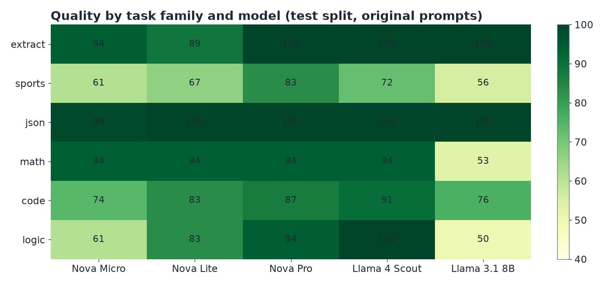
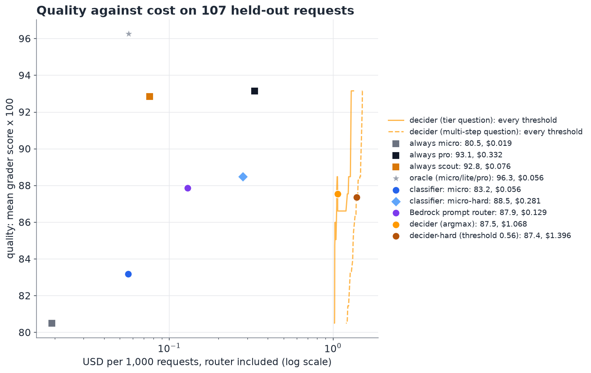
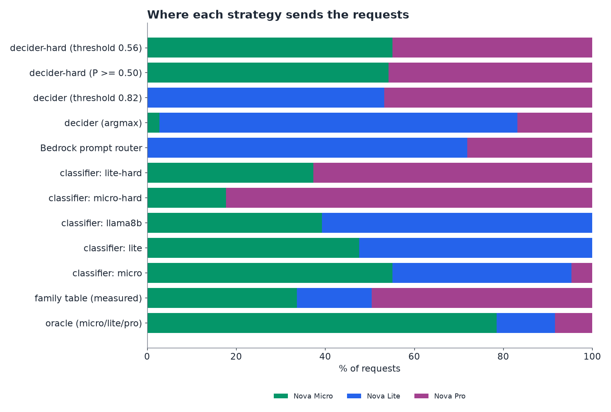
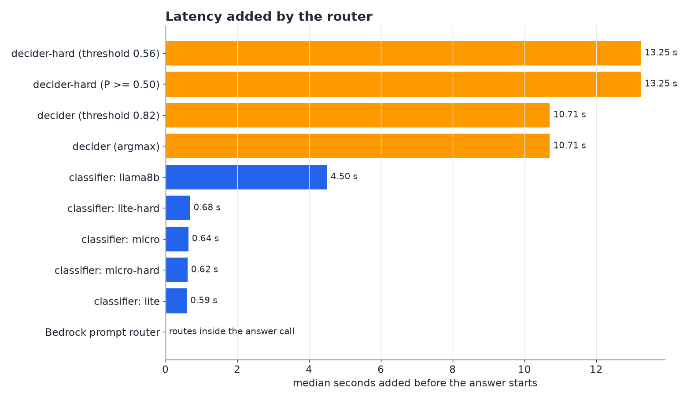
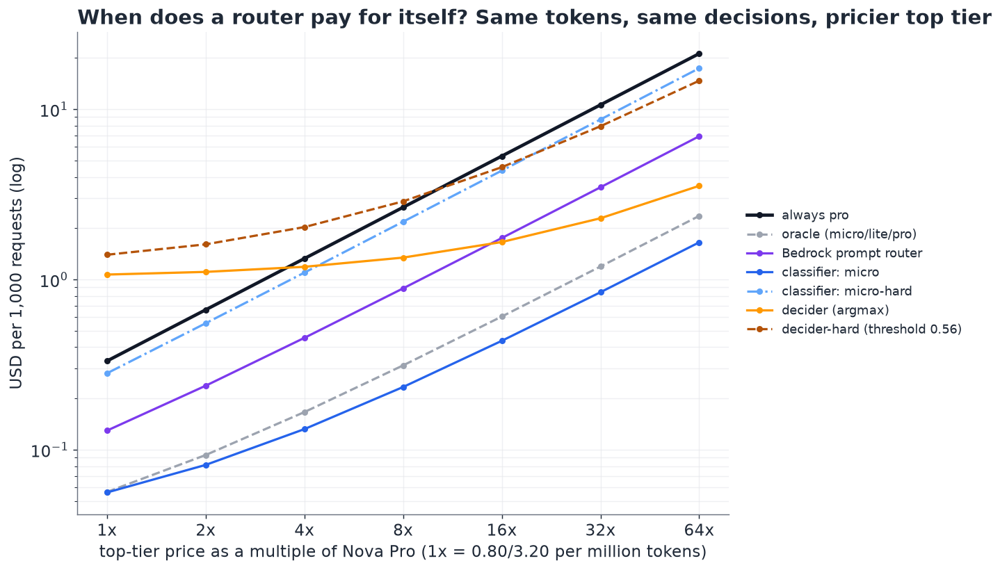
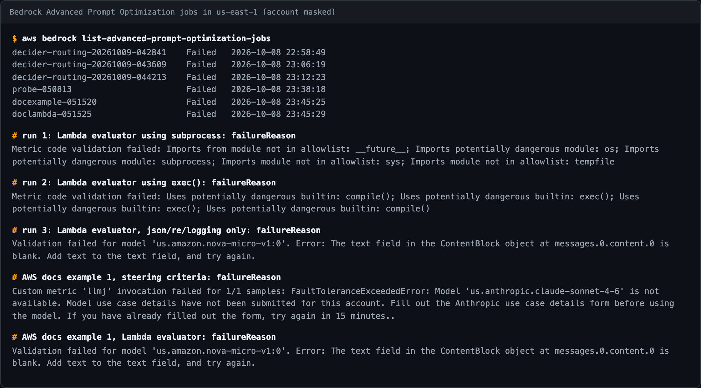
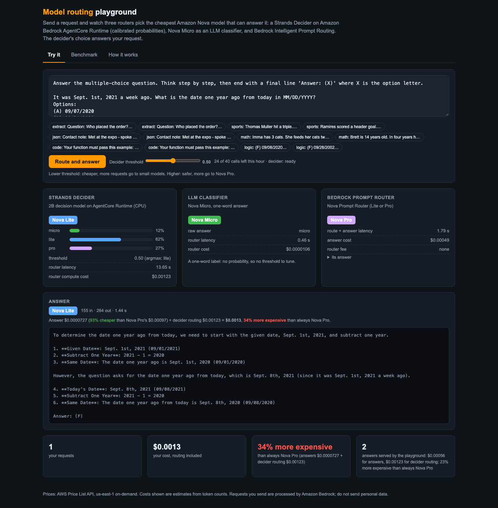
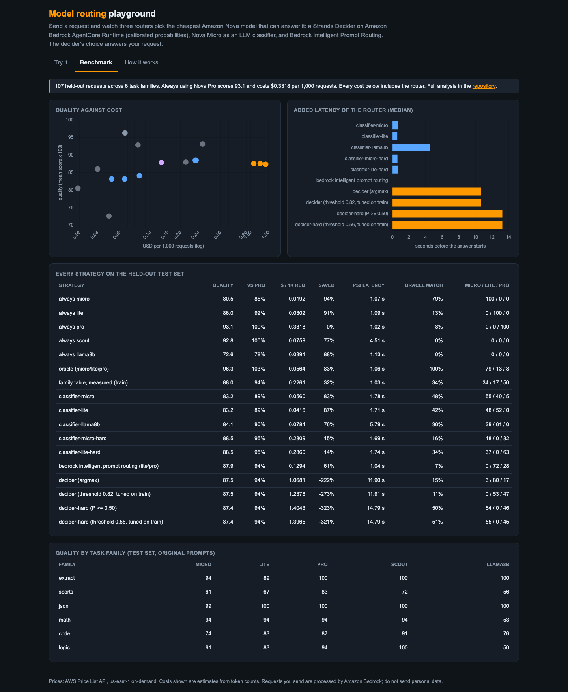

# Intelligent model routing with a Strands Decider on AgentCore Runtime

**Route each request to the cheapest Amazon Nova model that can answer it, and measure honestly whether that pays.** This use case compares a Strands Decider served from Amazon Bedrock AgentCore Runtime with LLM classifiers (Nova Micro, Nova Lite, Llama 3.1 8B), with Bedrock Intelligent Prompt Routing, and with offline model selection, on 216 graded requests across 6 task families.

**Live playground:** https://d3jcg138x8aln8.cloudfront.net (no sign-in, rate limited)


## The short version

Measured on 107 held-out requests (us-east-1, 8 to 9 October 2026, on-demand prices from the AWS Price List API):

| strategy | quality | cost per 1,000 requests (router included) | vs always Nova Pro | latency added by the router (median) |
|---|---|---|---|---|
| always Nova Pro | 93.1 | $0.332 | baseline | none |
| always Nova Micro | 80.5 | $0.019 | 94% cheaper | none |
| always Llama 4 Scout | 92.8 | $0.076 | 77% cheaper | none |
| **oracle** (cheapest model that is fully right) | 96.3 | $0.056 | 83% cheaper | none |
| Bedrock Intelligent Prompt Routing (Lite or Pro) | 87.9 | $0.129 | **61% cheaper** | **none** (routes inside the answer call) |
| LLM classifier: Nova Micro | 83.2 | $0.056 | 83% cheaper | 0.64 s |
| LLM classifier: Nova Lite | 83.2 | $0.042 | 87% cheaper | 0.59 s |
| LLM classifier: Nova Micro, "needs multi-step reasoning?" | 88.5 | $0.281 | 15% cheaper | 0.62 s |
| Strands Decider on AgentCore, tier question | 87.5 | $1.068 | **222% more expensive** | 10.7 s |
| Strands Decider on AgentCore, "needs multi-step reasoning?" (threshold tuned on train) | 87.4 | $1.397 | 321% more expensive | 13.3 s |

Quality is the mean grader score x 100; 1 is a fully correct answer.

What the numbers say:

1. **With Nova prices, a CPU decider is too expensive to route each request.** One routing decision on the 2 vCPU microVM takes about 11 seconds and costs about $0.001 of AgentCore compute. That is three times what Nova Pro charges, on average, to answer the request outright ($0.00033). No threshold can fix this, because the router's cost is paid on every request.
2. **The decider is the best judge of how hard a request is.** Asked "does answering this need careful multi-step reasoning?", it gives P(hard) of 0.15 for extraction and yes/no questions, 0.28 for JSON formatting, and 0.67 to 0.78 for maths, code and logic. Nova Micro asked the same question called 100% of JSON tasks and 72% of extraction tasks hard, and gave 29 answers that were neither yes nor no. The decider's routing matched the oracle's choice on 51% of requests, the most of any router.
3. **A hard request is not the same as one that needs a big model.** Nova Micro solves 94% of the GSM8K maths here. Routing on difficulty sends that maths to Pro and buys almost nothing.
4. **Measuring models on your own tasks beats clever routing.** The oracle shows Nova Micro fully solves 79% of requests. Llama 4 Scout matched Nova Pro's quality (92.8 against 93.1) at 77% less cost, with no router at all.
5. **Bedrock Intelligent Prompt Routing is the practical default for Nova traffic.** It has no router fee, adds no extra call, and saved 61% at 94% of Nova Pro's quality.
6. **The decider pays off only when the expensive tier is expensive.** With the same tokens and decisions, the decider beats always-top-tier once that model costs about 4 times Nova Pro (tier question, at lower quality) to 16 times (multi-step question). That is the price range of frontier models. See [price sensitivity](#when-does-a-router-pay-for-itself).
7. **Bedrock Advanced Prompt Optimization could not run in this account.** All six jobs failed. Every evaluation path depends on Anthropic models that the account has not enabled, and the Lambda evaluator has undocumented code restrictions. See [the APO section](#bedrock-advanced-prompt-optimization).

## Contents

- [What is being routed](#what-is-being-routed)
- [The routers](#the-routers)
- [How the benchmark is scored](#how-the-benchmark-is-scored)
- [Results in detail](#results-in-detail)
- [When does a router pay for itself?](#when-does-a-router-pay-for-itself)
- [Bedrock Advanced Prompt Optimization](#bedrock-advanced-prompt-optimization)
- [The playground](#the-playground)
- [Reproduce it](#reproduce-it)
- [Costs of this study](#costs-of-this-study)
- [Limits](#limits)

## What is being routed

Six task families, 36 requests each (216 total), split half and half into `train` (used for tuning thresholds and for prompt optimization) and `test` (used for every number above). Every family is graded automatically; there is no LLM judge anywhere in the benchmark.

| family | source | licence | grader |
|---|---|---|---|
| extract | synthetic order notes, seeded ("Who placed the order?") | this repo | the value, exactly |
| sports | BIG-Bench Hard `sports_understanding` | MIT | yes/no |
| json | synthetic contact notes to a 5-field JSON object, seeded | this repo | fraction of fields exactly right |
| math | GSM8K test | MIT | final number |
| code | MBPP sanitized test | CC-BY-4.0 | fraction of the dataset's unit tests that pass, run in a separate process |
| logic | BIG-Bench Hard: logical deduction (5 objects), shuffled objects (5), date understanding | MIT | option letter |

Target models: Nova Micro, Nova Lite and Nova Pro (the routing ladder), plus Llama 4 Scout 17B and Llama 3.1 8B as reference points. Every request was answered by all five at temperature 0 (1,079 calls; one Llama 3.1 8B call failed after throttling, so 215 requests have all five answers).



The ladder is less steep than the prices suggest. Nova Micro is within a few points of Nova Pro on extraction, JSON and maths. The real gaps are logic (61 against 94) and the sports plausibility questions (61 against 83).

## The routers

All the description-based routers get the same description of the three tiers ([`bench/routers.py`](bench/routers.py)), so the comparison is about the router, not the prompt:

| router | what it does | where it runs | what it returns |
|---|---|---|---|
| **Strands Decider, tier question** | one `choice` question: "Which is the cheapest model that will answer this request correctly?", with the three tier descriptions as options | `strands-decider-2B-hobson-v21`, int8, on AgentCore Runtime (2 vCPU, 8 GB microVM), 4 warm sessions | a calibrated probability per tier; the router takes the cheapest tier whose cumulative probability reaches a threshold |
| **Strands Decider, multi-step question** | one `noul` question: "Does answering this request correctly need careful multi-step reasoning?", with true/false criteria | same | P(yes); escalate to Pro when P reaches a threshold tuned on train, otherwise Micro |
| **LLM classifier** | the same tier question (or the same multi-step question) as a prompt, answered with one word | Nova Micro, Nova Lite or Llama 3.1 8B on Bedrock | a label, with no probability |
| **Bedrock Intelligent Prompt Routing** | the default Nova Prompt Router predicts which of Nova Lite and Nova Pro will answer better, and answers in the same call | Amazon Bedrock | the answer, plus the model that produced it |
| **family table** | per task family, the cheapest model within 3 points of the best on the train split | offline | a fixed model per family (this is what model selection without prompt rewriting gives you) |
| **oracle** | the cheapest tier that answered fully right (Pro if none did) | needs the answers in advance | an upper bound, not a real router |

Claude Haiku could not be included as a classifier: the account's Anthropic model access is not enabled (see [limits](#limits)).

## How the benchmark is scored

- **Quality:** the mean grader score of the answer each strategy would have returned. The routed model's answer comes from the same temperature-0 run used for the oracle. The Bedrock router produces its own answers, which are graded the same way.
- **Cost:** the answer's tokens times the model's on-demand price, plus the router.
  - **LLM classifier:** its tokens.
  - **Decider:** its measured inference time on AgentCore, billed at $0.1276 per vCPU-hour for both vCPUs plus $0.0169 per GB-hour for 4.2 GB.
  - **Bedrock router:** no fee, only the tokens of the model it chose.
- **Latency:** the router's time plus the answer's time, per request.
- **Tuning:** thresholds are chosen on the train split only, using the rule "the cheapest setting that keeps quality within 2 points of always-Pro". They are then reported on test.

The code is [`bench/evaluate.py`](bench/evaluate.py); the full table is [`results/summary.json`](results/summary.json).

## Results in detail



The orange curves trace every threshold of the two decider questions on the test set. They sit far to the right because the router's own cost (about $1 per 1,000 requests) is larger than the cost of answering with any model on the ladder. Moving the threshold moves quality between 80 and 93, but the cost hardly changes.



How each router behaved:

- **The decider, tier question,** followed the tier descriptions closely. It put JSON on Nova Lite (P = 0.84), as the description says, and spread everything else between Lite and Pro. It sent only 3% to Micro, although Micro was enough for 79%. The descriptions were mine, and the same ones misled every description-based router. A router that only reads descriptions inherits its author's assumptions; data from your own traffic corrects them.
- **The decider, multi-step question,** separated easy from hard families cleanly and matched the oracle on 51% of requests. That is the best of any router, but at 45% to Pro it still overpaid on maths that Micro solves.
- **Nova Micro and Nova Lite as classifiers** were cheap and fast (about 0.6 s) but lost 10 points of quality. They sent most logic puzzles to Micro and Lite. With the multi-step question they swung the other way, sending 82% (Micro) and 63% (Lite) to Pro.
- **Llama 3.1 8B as a classifier** is limited by its account quota (8 requests per minute on demand), which shows up as 4.5 s of added latency.
- **Bedrock Intelligent Prompt Routing** chose Lite for 69% and Pro for 31% of all requests, and kept 94% of Pro's quality. It is the strongest real router here on cost against quality, and the only one with no added latency.



## When does a router pay for itself?

The decider's cost is fixed per request, while the savings scale with the price of the model it avoids. Re-pricing the top tier at k times Nova Pro, with the same tokens and the same routing decisions, shows where each strategy crosses "always top tier":



| top tier at | always top tier | decider, tier question | decider, multi-step (tuned) | Bedrock router | Nova Micro classifier |
|---|---|---|---|---|---|
| 1x (Nova Pro) | $0.33 | $1.07 | $1.40 | $0.13 | $0.06 |
| 4x | $1.33 | $1.19 | $2.03 | $0.45 | $0.13 |
| 16x | $5.31 | $1.66 | $4.57 | $1.75 | $0.44 |
| 64x | $21.23 | $3.55 | $14.71 | $6.94 | $1.65 |

(USD per 1,000 requests.) Two cautions:
- This is a what-if on token prices; the quality columns do not change with price.
- The decider's tier question becomes cheaper than the Bedrock router above about 16 times Nova Pro's price, because it sends only 17% of requests to the top tier. It does so at 87.5 quality against 93.1.

The Nova Micro classifier stays the cheapest dynamic router at every price shown, at 83.2 quality. In a real deployment the Bedrock router also only covers models in its own family.

**When the decider fits as a router:**
- The expensive tier is a frontier-priced model, roughly 10 times Nova Pro or more.
- Requests are long or produce long answers, so each avoided call is worth more than a cent.
- Its calibrated P(hard) is reused, for example to tune a threshold once for a whole task type, rather than paid on every request.

On a GPU host its per-decision cost would be far lower. I did not measure that here; this use case is about AgentCore Runtime.

## Bedrock Advanced Prompt Optimization

[Advanced Prompt Optimization](https://docs.aws.amazon.com/bedrock/latest/userguide/advanced-prompt-optimization.html) (APO, launched 14 May 2026) rewrites a prompt template for up to 5 target models. It scores the original and optimized prompt on each model against your metric, and reports cost and latency, which makes it a per-task model selection tool. The plan was:
- one template per task family (6 templates, 18 train samples each);
- five target models: Nova Micro, Nova Lite, Nova Pro, Llama 4 Scout and Llama 3.1 8B;
- graded by the same exact graders as the benchmark, deployed as a Lambda evaluator;
- then routing each family to the model APO recommends, run with its optimized prompt on the test split.

The job input is [`data/apo_input.jsonl`](data/apo_input.jsonl), the evaluator [`apo/lambda_function.py`](apo/lambda_function.py), and the driver [`apo/apo.py`](apo/apo.py) (`setup`, `input`, `create`, `status`, `fetch`, `parse`). `bench/evaluate.py` scores APO's selection as soon as `results/apo_scores.json` exists.

All six jobs failed. What each attempt taught:



| attempt | result | lesson |
|---|---|---|
| Lambda evaluator that ran each code answer's unit tests in a subprocess | `Metric code validation failed: Imports ... not in allowlist: __future__, os, subprocess, sys, tempfile` | Bedrock reads the evaluator's source before the job and allows only some imports. This is not in the documentation. |
| Evaluator using `compile()` and `exec()` to run tests in-process | `Uses potentially dangerous builtin: compile(); ... exec()` | An APO evaluator cannot execute code at all. For code tasks it can only check the answer's shape (function name, arguments, a return). On this data that static check gave every answer 1.0, whether or not its tests passed. |
| Evaluator using only `json`, `re` and `logging` (agrees with the local graders on 216 of 216 real answers) | every entry: `The text field in the ContentBlock object at messages.0.content.0 is blank`, with `dataset: []` | No samples reached the models. |
| AWS's documentation example 1, verbatim, with steering criteria | `Model 'us.anthropic.claude-sonnet-4-6' is not available. Model use case details have not been submitted for this account.` | Steering criteria and the default evaluator are judged by Claude Sonnet 4.6. |
| The same documentation example with the Lambda evaluator | the same blank-message failure | The failure is not caused by this dataset. |

**Conclusion:** in an account without Anthropic model access, APO cannot run with any evaluation method. The built-in judges, custom LLM judges and steering criteria all run on Claude models. The Lambda path also failed, the same way, even on the documentation's own example. To finish the comparison, enable Anthropic model access (the use case details form in the Bedrock console), then run `python apo/apo.py create`, `fetch` and `parse` followed by `python bench/evaluate.py`. Two smaller notes:
- The list API returns its jobs under `jobSummaries`, not `advancedPromptOptimizationJobSummaries` as the documentation shows.
- The results files of the failed jobs report zero input tokens, zero output tokens and a score of 0 for every model.

Until then, the **family table** row is the closest stand-in for APO's model selection without prompt rewriting. It is the cheapest model per family within 3 points of the best on train: 88.0 quality, 32% cheaper than always Pro. It did worse than Bedrock's router and much worse than simply choosing Llama 4 Scout. With 18 train samples per family, 3 points is less than one wrong answer, so the table often fell back to Pro.

## The playground

https://d3jcg138x8aln8.cloudfront.net

| | |
|---|---|
|  |  |

How to use it:
- **Try it:** send a request, or pick one of 12 samples from the test set. Three routers decide in parallel: the decider (with a threshold slider), Nova Micro as a classifier, and Bedrock's Nova router. The decider's choice answers.
- **Costs are honest:** the page shows the answer's cost, the decider's routing cost and the total next to what Nova Pro would have cost for the same tokens. It also keeps running totals for you and for the whole playground. The totals usually show the decider making requests more expensive, which is the point of this study.
- **Benchmark tab:** the full results table and charts.
- **A 3x-speed recording:** [`docs/img/playground.mp4`](docs/img/playground.mp4).

How it is built ([`playground/`](playground), AWS CDK):

```
CloudFront ── S3 (index.html, samples.json, summary.json)
     └── /api/* ── API Gateway HTTP API (5 rps, burst 10) ── Lambda (Python 3.12, arm64)
                                                              ├── Bedrock: Nova Micro / Lite / Pro, Nova Prompt Router
                                                              ├── AgentCore Runtime: the decider (one shared session id)
                                                              └── DynamoDB: per-IP hourly and global daily counters, usage totals
EventBridge (every 10 min) ── Lambda {"warm": true} ── keeps one decider session warm
```

Rate limits, with no keys or sign-in:
- **Per visitor:** 40 calls per hour per IP; one playground run uses 4.
- **Whole playground:** 1,500 calls per day.
- **API Gateway throttle:** 5 requests per second.
- **Input and output caps:** prompts of 2,500 characters or fewer, answers of 700 tokens or fewer.
- **CloudFront only:** CloudFront adds a secret origin header, and the Lambda refuses requests without it, so the per-IP limit cannot be bypassed by calling API Gateway directly.

Change the limits with `-c perIpHour=... -c globalDay=...`, and disable the warm-keeping with `-c keepWarm=false`.

Running cost:
- **Warm decider session:** about 4.2 GB of memory held by the AgentCore session, $0.071 per hour, about $51 per month, plus about $0.001 per decision.
- **Everything else:** Lambda, API Gateway, DynamoDB and CloudFront are cents at these limits.
- **Bedrock tokens:** at most 1,500 calls per day of short Nova requests.

## Reproduce it

```bash
cd usecases/model-routing
pip install -e "../..[dev]" pandas pyarrow matplotlib huggingface_hub fastapi
export AWS_PROFILE=... AWS_REGION=us-east-1

python bench/build_dataset.py                          # data/tasks.jsonl (seeded; downloads GSM8K, MBPP, BBH)
python bench/run_targets.py                            # every task x 5 models -> results/answers.jsonl
python bench/run_routers.py --routers decider,decider-hard,classifier-micro,classifier-lite,classifier-llama8b,classifier-micro-hard,classifier-lite-hard,bedrock
python bench/evaluate.py                               # results/summary.json and the tables above
python bench/charts.py                                 # docs/img/*.png

# Bedrock Advanced Prompt Optimization (needs Anthropic model access in the account)
python apo/apo.py setup && python apo/apo.py input && python apo/apo.py create
python apo/apo.py status                               # then: fetch, parse
python bench/run_targets.py --models micro,lite,pro,scout,llama8b --prompts optimized --split test
python bench/evaluate.py

# the playground (needs the decider deployed: see the repository README)
./playground/build.sh
cd playground/infra && npm install && npx cdk deploy -c deciderArn=<triage runtime ARN>
```

The decider router needs a deployed decider (`python deciderctl.py add triage --model v21 && agentcore deploy -y` in the repository root). All scripts resume where they stopped.

## Costs of this study

| item | cost |
|---|---|
| 1,079 benchmark answers (5 models) | $0.106 |
| 432 decider routing decisions on AgentCore (compute) | $0.54 |
| 1,080 LLM classifier decisions | $0.020 |
| 216 Bedrock router answers | $0.031 |
| Advanced Prompt Optimization (6 failed jobs) | no optimization metrics were produced; any charge would be small |

## Limits

- **Small and narrow.** 107 test requests in 6 families. Differences under about 3 quality points are within noise. A different traffic mix, with longer documents or harder reasoning, would change the ladder and the oracle.
- **Zero-shot decider.** The decider was used without any training for routing. A decider fine-tuned on oracle labels from your own traffic is the obvious next step, but it does not change the per-decision compute cost on CPU.
- **Gated models.** Claude models (including Haiku, the classifier originally planned) are gated in the test account, which also blocked APO.
- **Quota-bound Llama latency.** Llama 4 Scout and Llama 3.1 8B latencies include throttling under low account quotas (Scout's p95 of 37 s is quota-bound, not model speed).
- **Price sensitivity is a what-if.** It scales token prices only. A real frontier model would also answer differently.
- **Approximate decider cost.** The decider's cost uses AgentCore's consumption pricing for active CPU plus memory during inference. The idle memory of warm sessions is a separate fixed cost, about $0.071 per session-hour.
