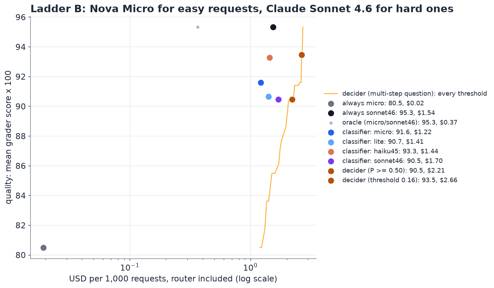
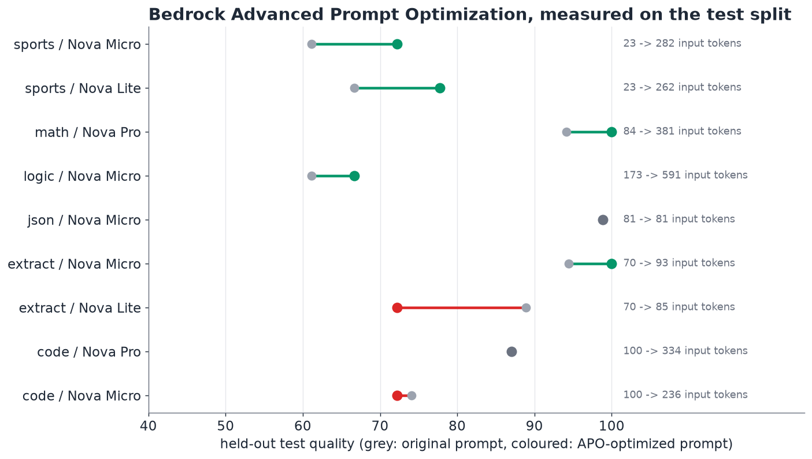

# Intelligent model routing with a Strands Decider on AgentCore Runtime

**Route each request to the cheapest Amazon Nova model that can answer it, and measure honestly whether that pays.** This use case compares a Strands Decider served from Amazon Bedrock AgentCore Runtime with LLM classifiers (Nova Micro, Nova Lite, Llama 3.1 8B, Claude Haiku 4.5, Claude Sonnet 4.6), with Bedrock Intelligent Prompt Routing, and with per-task model selection from Bedrock Advanced Prompt Optimization, on 216 graded requests across 6 task families.

**Live playground:** https://d3jcg138x8aln8.cloudfront.net (no sign-in, rate limited)


## The short version

Measured on 107 held-out requests (us-east-1, 8 to 9 October 2026, on-demand prices from the AWS Price List API):

| strategy | quality | cost per 1,000 requests (router included) | vs always Nova Pro | latency added by the router (median) |
|---|---|---|---|---|
| always Nova Pro | 93.1 | $0.332 | baseline | none |
| always Nova Micro | 80.5 | $0.019 | 94% cheaper | none |
| always Llama 4 Scout | 92.8 | $0.076 | 77% cheaper | none |
| **oracle** (cheapest model that is fully right) | 96.3 | $0.056 | 83% cheaper | none |
| Bedrock Intelligent Prompt Routing (Lite or Pro) | 87.9 | $0.129 | **61% cheaper** | **none** (routes inside the answer call) |
| LLM classifier: Nova Micro | 83.2 | $0.056 | 83% cheaper | 0.64 s |
| LLM classifier: Nova Lite | 83.2 | $0.042 | 87% cheaper | 0.59 s |
| LLM classifier: Nova Micro, "needs multi-step reasoning?" | 88.5 | $0.281 | 15% cheaper | 0.62 s |
| LLM classifier: Claude Haiku 4.5, "needs multi-step reasoning?" | 89.2 | $0.456 | 37% more expensive | 0.94 s (paced) |
| LLM classifier: Claude Sonnet 4.6, tier question | 88.8 | $1.038 | 213% more expensive | 1.09 s (paced) |
| Strands Decider on AgentCore, tier question | 87.5 | $1.068 | **222% more expensive** | 10.7 s |
| Strands Decider on AgentCore, "needs multi-step reasoning?" (threshold tuned on train) | 87.4 | $1.397 | 321% more expensive | 13.3 s |

Quality is the mean grader score x 100; 1 is a fully correct answer. The account's Claude quota is 10 requests per minute, which inflated latencies during the full run; the Claude latencies shown are medians of 20 paced requests per model ([`results/claude-latency-paced.json`](results/claude-latency-paced.json)).

With a real frontier model as the expensive tier, **Nova Micro for easy requests and Claude Sonnet 4.6 for hard ones**:

| strategy | quality | cost per 1,000 requests | vs always Sonnet 4.6 |
|---|---|---|---|
| always Claude Sonnet 4.6 | 95.3 | $1.543 | baseline |
| oracle | 95.3 | $0.365 | 76% cheaper |
| Nova Micro classifier | 91.6 | $1.215 | 21% cheaper |
| Claude Haiku 4.5 classifier | 93.3 | $1.443 | 6% cheaper |
| Strands Decider, P >= 0.50 | 90.5 | $2.207 | 43% more expensive |
| Strands Decider, threshold tuned on train | 93.5 | $2.656 | 72% more expensive |

What the numbers say:

1. **With Nova prices, a CPU decider is too expensive to route each request.** One routing decision on the 2 vCPU microVM takes about 11 seconds and costs about $0.001 of AgentCore compute. That is three times what Nova Pro charges, on average, to answer the request outright ($0.00033). No threshold can fix this, because the router's cost is paid on every request.
2. **The decider is the best judge of how hard a request is.** Asked "does answering this need careful multi-step reasoning?", it gives P(hard) of 0.15 for extraction and yes/no questions, 0.28 for JSON formatting, and 0.67 to 0.78 for maths, code and logic: it separates the multi-step families perfectly (ROC AUC 1.00). With the same question Claude Sonnet 4.6 reaches 0.88 (it flagged only 42% of code tasks), Claude Haiku 4.5 0.78 and Nova Micro 0.60 (it called every JSON task hard).
3. **LLM classifiers can be talked into answering; a decider cannot.** On about 40 of 216 requests each, Claude Haiku 4.5 and Claude Sonnet 4.6 ignored the routing instruction and started solving the task ("249.99", "Let me trace through each..."). A decider only answers its typed question. (One prompt was used for every classifier; a system prompt or prefill would reduce this for Claude.)
4. **A hard request is not the same as one that needs a big model.** Nova Micro solves 94% of the GSM8K maths here. Routing on difficulty sends that maths to Pro and buys almost nothing.
5. **Measuring models on your own tasks beats clever routing.** The oracle shows Nova Micro fully solves 79% of requests. Llama 4 Scout matched Nova Pro's quality (92.8 against 93.1) at 77% less cost, with no router at all.
6. **Bedrock Intelligent Prompt Routing is the practical default for Nova traffic.** It has no router fee, adds no extra call, and saved 61% at 94% of Nova Pro's quality.
7. **Even against Claude Sonnet 4.6, the decider lost on these short tasks.** An average Sonnet answer here cost $0.0015; a decision costs $0.0012. Routing half the traffic away breaks even once an average expensive answer costs about $0.0022, 1.4 times these. Long contexts and long answers cross that line; short questions do not. See [routing to Claude Sonnet 4.6](#routing-to-claude-sonnet-46) and [price sensitivity](#when-does-a-router-pay-for-itself).
8. **Bedrock Advanced Prompt Optimization is a useful per-task model selector, if you check it on held-out data.** Its rewrites lifted maths on Nova Pro from 94 to 100 and sports on Nova Micro from 61 to 72 on the test split, but one rewrite that scored 1.00 on training fell from 89 to 72 on test. Model selection with optimized prompts reached 88.3 quality at 16% below always Nova Pro. See [the APO section](#bedrock-advanced-prompt-optimization).
9. **No combination of decider and LLM classifier beat the best single router** on this single-step benchmark. The pattern that the measurements support is a division of labour: a decision model where one judgment is reused (a multi-step process, a task type, a guardrail) and a small LLM classifier or Bedrock's router for per-request calls. See [combinations](#combining-a-decider-with-an-llm-classifier) and [guidance](#choosing-what-makes-the-routing-call).

## Contents

- [What is being routed](#what-is-being-routed)
- [The routers](#the-routers)
- [How the benchmark is scored](#how-the-benchmark-is-scored)
- [Results in detail](#results-in-detail)
- [Routing to Claude Sonnet 4.6](#routing-to-claude-sonnet-46)
- [When does a router pay for itself?](#when-does-a-router-pay-for-itself)
- [Combining a decider with an LLM classifier](#combining-a-decider-with-an-llm-classifier)
- [Bedrock Advanced Prompt Optimization](#bedrock-advanced-prompt-optimization)
- [Choosing what makes the routing call](#choosing-what-makes-the-routing-call)
- [The playground](#the-playground)
- [Reproduce it](#reproduce-it)
- [Costs of this study](#costs-of-this-study)
- [Limits](#limits)

## What is being routed

Six task families, 36 requests each (216 total), split half and half into `train` (used for tuning thresholds and for prompt optimization) and `test` (used for every number above). Every family is graded automatically; there is no LLM judge anywhere in the benchmark.

| family | source | licence | grader |
|---|---|---|---|
| extract | synthetic order notes, seeded ("Who placed the order?") | this repo | the value, exactly |
| sports | BIG-Bench Hard `sports_understanding` | MIT | yes/no |
| json | synthetic contact notes to a 5-field JSON object, seeded | this repo | fraction of fields exactly right |
| math | GSM8K test | MIT | final number |
| code | MBPP sanitized test | CC-BY-4.0 | fraction of the dataset's unit tests that pass, run in a separate process |
| logic | BIG-Bench Hard: logical deduction (5 objects), shuffled objects (5), date understanding | MIT | option letter |

Target models: Nova Micro, Nova Lite and Nova Pro (the routing ladder), Claude Sonnet 4.6 (the frontier tier of the second ladder), plus Llama 4 Scout 17B, Llama 3.1 8B and Claude Haiku 4.5 as reference points. Every request was answered by all seven at temperature 0 (1,511 calls; one Llama 4 Scout call failed after throttling, so 215 requests have all seven answers). Claude Sonnet 4.6 stands in for Claude Sonnet 5.5, which is not yet available to the test account.


The ladder is less steep than the prices suggest. Nova Micro is within a few points of Nova Pro on extraction, JSON and maths. The real gaps are logic (61 against 94) and the sports plausibility questions (61 against 83).

## The routers

All the description-based routers get the same description of the three tiers ([`bench/routers.py`](bench/routers.py)), so the comparison is about the router, not the prompt:

| router | what it does | where it runs | what it returns |
|---|---|---|---|
| **Strands Decider, tier question** | one `choice` question: "Which is the cheapest model that will answer this request correctly?", with the three tier descriptions as options | `strands-decider-2B-hobson-v21`, int8, on AgentCore Runtime (2 vCPU, 8 GB microVM), 4 warm sessions | a calibrated probability per tier; the router takes the cheapest tier whose cumulative probability reaches a threshold |
| **Strands Decider, multi-step question** | one `noul` question: "Does answering this request correctly need careful multi-step reasoning?", with true/false criteria | same | P(yes); escalate to Pro when P reaches a threshold tuned on train, otherwise Micro |
| **LLM classifier** | the same tier question (or the same multi-step question) as a prompt, answered with one word | Nova Micro, Nova Lite, Llama 3.1 8B, Claude Haiku 4.5 or Claude Sonnet 4.6 on Bedrock (Claude through the global cross-Region profiles) | a label, with no probability |
| **Bedrock Intelligent Prompt Routing** | the default Nova Prompt Router predicts which of Nova Lite and Nova Pro will answer better, and answers in the same call | Amazon Bedrock | the answer, plus the model that produced it |
| **family table** | per task family, the cheapest model within 3 points of the best on the train split | offline | a fixed model per family (this is what model selection without prompt rewriting gives you) |
| **oracle** | the cheapest tier that answered fully right (Pro if none did) | needs the answers in advance | an upper bound, not a real router |

## How the benchmark is scored

- **Quality:** the mean grader score of the answer each strategy would have returned. The routed model's answer comes from the same temperature-0 run used for the oracle. The Bedrock router produces its own answers, which are graded the same way.
- **Cost:** the answer's tokens times the model's on-demand price, plus the router.
  - **LLM classifier:** its tokens.
  - **Decider:** its measured inference time on AgentCore, billed at $0.1276 per vCPU-hour for both vCPUs plus $0.0169 per GB-hour for 4.2 GB.
  - **Bedrock router:** no fee, only the tokens of the model it chose.
- **Latency:** the router's time plus the answer's time, per request.
- **Tuning:** thresholds are chosen on the train split only, using the rule "the cheapest setting that keeps quality within 2 points of always-Pro". They are then reported on test.

The code is [`bench/evaluate.py`](bench/evaluate.py); the full table is [`results/summary.json`](results/summary.json).

## Results in detail


The orange curves trace every threshold of the two decider questions on the test set. They sit far to the right because the router's own cost (about $1 per 1,000 requests) is larger than the cost of answering with any model on the ladder. Moving the threshold moves quality between 80 and 93, but the cost hardly changes.


How each router behaved:

- **The decider, tier question,** followed the tier descriptions closely. It put JSON on Nova Lite (P = 0.84), as the description says, and spread everything else between Lite and Pro. It sent only 3% to Micro, although Micro was enough for 79%. The descriptions were mine, and the same ones misled every description-based router. A router that only reads descriptions inherits its author's assumptions; data from your own traffic corrects them.
- **The decider, multi-step question,** separated easy from hard families perfectly and matched the oracle on 51% of requests (the Claude Sonnet 4.6 classifier, at 53%, was the only router above it). At 45% to Pro it still overpaid on maths that Micro solves.
- **Nova Micro and Nova Lite as classifiers** were cheap and fast (about 0.6 s) but lost 10 points of quality. They sent most logic puzzles to Micro and Lite. With the multi-step question they swung the other way, sending 82% (Micro) and 63% (Lite) to Pro.
- **Llama 3.1 8B as a classifier** is limited by its account quota (8 requests per minute on demand), which shows up as 4.5 s of added latency.
- **Claude Haiku 4.5 and Claude Sonnet 4.6 as classifiers** routed with about 87 to 89 quality, but each costs more per decision than routing saves on the Nova ladder (Haiku adds $0.37 to $0.43 per 1,000 requests, Sonnet about $0.8 to $1.0). About 18% of their answers began solving the request instead of routing it; an unparseable answer counts as "pro".
- **Bedrock Intelligent Prompt Routing** chose Lite for 69% and Pro for 31% of all requests, and kept 94% of Pro's quality. It is the strongest real router here on cost against quality, and the only one with no added latency.


## Routing to Claude Sonnet 4.6

Nova Pro is cheap, so the second ladder uses a real frontier price: Nova Micro for easy requests, Claude Sonnet 4.6 ($3.30 / $16.50 per million input / output tokens) for hard ones. Only the routers that judge difficulty apply; a "hard" verdict sends the request to Sonnet.



| strategy | quality | $ / 1k requests | vs always Sonnet | oracle match |
|---|---|---|---|---|
| always Claude Sonnet 4.6 | 95.3 | 1.543 | baseline | 21% |
| oracle (Micro if Micro is fully right) | 95.3 | 0.365 | 76% cheaper | 100% |
| classifier: Nova Micro | 91.6 | 1.215 | 21% cheaper | 26% |
| classifier: Nova Lite | 90.7 | 1.410 | 9% cheaper | 42% |
| classifier: Claude Haiku 4.5 | 93.3 | 1.443 | 6% cheaper | 44% |
| classifier: Claude Sonnet 4.6 | 90.5 | 1.699 | 10% more expensive | 59% |
| decider, P >= 0.50 | 90.5 | 2.207 | 43% more expensive | 57% |
| decider, threshold 0.16 (tuned on train) | 93.5 | 2.656 | 72% more expensive | 36% |

The decider routes as well as anything here (57% oracle match at P >= 0.50), but its $0.0012 per decision is close to the $0.0015 an average Sonnet answer cost on these short tasks. At P >= 0.50 it sends 54% of requests to Micro, so it breaks even once an average expensive answer costs about **$0.0022**. Long documents, large agent contexts and long generated answers are above that line.

## When does a router pay for itself?

The decider's cost is fixed per request, while the savings scale with the price of the model it avoids. Re-pricing the top tier at k times Nova Pro, with the same tokens and the same routing decisions, shows where each strategy crosses "always top tier":


| top tier at | always top tier | decider, tier question | decider, multi-step (tuned) | Bedrock router | Nova Micro classifier |
|---|---|---|---|---|---|
| 1x (Nova Pro) | $0.33 | $1.07 | $1.40 | $0.13 | $0.06 |
| 4x | $1.33 | $1.19 | $2.03 | $0.45 | $0.13 |
| 16x | $5.31 | $1.66 | $4.57 | $1.75 | $0.44 |
| 64x | $21.23 | $3.55 | $14.71 | $6.94 | $1.65 |

(USD per 1,000 requests.) Two cautions:
- This is a what-if on token prices; the quality columns do not change with price.
- The decider's tier question becomes cheaper than the Bedrock router above about 16 times Nova Pro's price, because it sends only 17% of requests to the top tier. It does so at 87.5 quality against 93.1.

The Nova Micro classifier stays the cheapest dynamic router at every price shown, at 83.2 quality. In a real deployment the Bedrock router also only covers models in its own family.

**When the decider fits as a router:**
- The expensive tier is a frontier-priced model, roughly 10 times Nova Pro or more.
- Requests are long or produce long answers, so each avoided call is worth more than a cent.
- Its calibrated P(hard) is reused, for example to tune a threshold once for a whole task type, rather than paid on every request.

On a GPU host its per-decision cost would be far lower. I did not measure that here; this use case is about AgentCore Runtime.

## Bedrock Advanced Prompt Optimization

[Advanced Prompt Optimization](https://docs.aws.amazon.com/bedrock/latest/userguide/advanced-prompt-optimization.html) (APO, launched 14 May 2026) rewrites a prompt template for up to 5 target models. It reports the score on your metric, the cost and the latency of the original and optimized prompt per model, which makes it a per-task model selector.

The setup:
- **Templates:** 6 (one per task family), 18 train samples each ([`data/apo_input.jsonl`](data/apo_input.jsonl)).
- **Evaluator:** a Lambda function running the same exact graders as the benchmark, for 5 families ([`apo/lambda_function.py`](apo/lambda_function.py)). APO evaluators may not execute code (the service rejects `os`, `subprocess`, `sys` and `tempfile` imports and `exec`/`compile`), so the code family uses an LLM judge, Claude Sonnet 4.6, that traces the reference tests.
- **Targets:** Nova Micro, Nova Lite, Nova Pro, Claude Haiku 4.5 and Claude Sonnet 4.6, one job per model ([`apo/apo.py`](apo/apo.py): `create <model> [families]`).
- **Coverage:** with the account's Claude quota at 10 requests per minute, many entries were throttled or hit an intermittent service error. 9 (family, model) pairs completed; every family has at least one.

Each completed pair was then run on the **held-out test split** with its optimized prompt ([`results/apo_pairs.json`](results/apo_pairs.json)):



| family / model | APO train score, original -> optimized | test score, original -> optimized | input tokens, original -> optimized |
|---|---|---|---|
| code / Nova Micro | 0.26 -> 0.63 (judge scale) | 74.1 -> 72.2 | 100 -> 236 |
| code / Nova Pro | 0.23 -> 0.74 (judge scale) | 87.0 -> 87.0 | 100 -> 334 |
| extract / Nova Lite | 1.00 -> 1.00 | 88.9 -> 72.2 | 70 -> 85 |
| extract / Nova Micro | 1.00 -> 1.00 | 94.4 -> 100.0 | 70 -> 93 |
| json / Nova Micro | 1.00 -> 1.00 | 98.9 -> 98.9 | 81 -> 81 |
| logic / Nova Micro | 0.72 -> 0.94 | 61.1 -> 66.7 | 173 -> 591 |
| math / Nova Pro | 0.78 -> 1.00 | 94.1 -> 100.0 | 84 -> 381 |
| sports / Nova Lite | 0.78 -> 1.00 | 66.7 -> 77.8 | 23 -> 262 |
| sports / Nova Micro | 0.78 -> 0.94 | 61.1 -> 72.2 | 23 -> 282 |

What it shows:
- **Most rewrites helped on unseen requests:** maths on Nova Pro 94 to 100, extract on Nova Micro 94 to 100, sports on Micro and Lite +11 points each, logic on Micro +6.
- **The train score did not predict the test score.** Extract on Nova Lite scored 1.00 on train before and after, yet the optimized prompt fell from 89 to 72 on test. The Nova Pro code rewrite memorised details of training examples (a regex for words starting with a capital P) and gained nothing on test.
- **Rewrites are longer:** sports went from 23 to 282 input tokens, logic from 173 to 591. On Nova Micro that is still cheap; on a frontier model it matters.

**APO as model selection:** per family, the cheapest model within 0.03 of APO's best reported score. On the test split it reached **88.3 quality at $0.278 per 1,000 requests (16% cheaper than always Nova Pro)** with the optimized prompts, against 83.6 at $0.124 with the same models and the original prompts.

## Combining a decider with an LLM classifier

The obvious next step is to combine the two kinds of router. I measured each combination per request, which is k = 1: one decider judgment per request. The k = 5 and k = 10 columns are a **projection**: they assume one decider judgment covers k steps of a multi-step process. No real multi-step workflow was benchmarked.

| ladder | combination | quality | $ / 1k, measured (k = 1) | projection k = 5 | projection k = 10 |
|---|---|---|---|---|---|
| Nova | decider gate (P < 0.5 to Micro), hard to Nova Micro tier classifier | 83.0 | 1.22 | 0.28 | 0.16 |
| Nova | decider gate, hard to a classifier choosing Lite or Pro | 85.8 | 1.23 | 0.28 | 0.17 |
| Nova | Nova Micro classifier first, decider confirms escalations | 86.4 | 1.17 | 0.40 | 0.31 |
| Nova | Claude Haiku 4.5 classifier first, decider confirms escalations | 87.4 | 1.22 | 0.58 | 0.49 |
| Nova | decider alone (P >= 0.5) | 87.4 | 1.40 | 0.46 | 0.34 |
| Sonnet | decider gate, hard to Nova Micro tier classifier | 86.7 | 1.62 | 0.68 | 0.56 |
| Sonnet | Nova Micro classifier first, decider confirms escalations | 89.5 | 1.82 | 1.05 | 0.96 |
| Sonnet | decider alone (P >= 0.5) | 90.5 | 2.21 | 1.26 | 1.15 |

Single routers on the Sonnet ladder for comparison: Nova Micro tier classifier 86.9 at $0.74, Nova Micro multi-step classifier 91.6 at $1.22, Claude Haiku 4.5 multi-step classifier 93.3 at $1.44, always Sonnet 95.3 at $1.54.

**Measured verdict:** no combination beat the best single routers on quality per dollar. Gating with a perfect difficulty judge does not help when "hard" is a poor predictor of "the small model fails" (maths is hard but Micro solves 94% of it; sports is easy but Micro gets 61%). **Projection:** if one decider judgment is shared by about 5 to 10 steps, decider routing on the Sonnet ladder reaches 90.5 quality at $1.15 to $1.26 per 1,000, 18 to 25% cheaper than always Sonnet, still below Haiku's 93.3.

## Choosing what makes the routing call


What the measurements support:

1. **Price the single-model baselines first.** Always Llama 4 Scout (92.8 at $0.076) beat every router here on quality.
2. **Per-request routing:** Bedrock Intelligent Prompt Routing when your models fit one of its routers (no fee, no added latency, 61% saved); otherwise a small LLM classifier with a one-word answer, strict parsing and a default tier.
3. **Do not use a frontier model as the per-request router** for a cheap ladder: the Claude classifiers cost more than they saved and drifted into answering on about 18% of requests.
4. **Use a decision model for judgments that are reused** (once per multi-step process, once per task type, guardrails, triage). It judged difficulty perfectly (ROC AUC 1.00), never drifted, and gave a probability whose threshold can be tuned on data.
5. **On CPU, per-request decider routing pays only when the expensive answer is expensive:** break-even here is an average expensive answer of about $0.0022.
6. **Route on measured capability per task family**, and check every description you give a router against those measurements.
7. **For fixed task types, choose the model once per type** (APO model selection or one decider judgment) and keep any rewritten prompt only after a held-out check.

## The playground

https://d3jcg138x8aln8.cloudfront.net

| | |
|---|---|
|  |  |

How to use it:
- **Try it:** send a request, or pick one of 12 samples from the test set. Four routers decide in parallel: the decider (with a threshold slider), Nova Micro and Claude Haiku 4.5 as classifiers, and Bedrock's Nova router. The decider's choice answers.
- **Costs are honest:** the page shows the answer's cost, the decider's routing cost and the total next to what Nova Pro would have cost for the same tokens. It also keeps running totals for you and for the whole playground. The totals usually show the decider making requests more expensive, which is the point of this study.
- **Benchmark tab:** the full results table and charts.
- **A 3x-speed recording:** [`docs/img/playground.mp4`](docs/img/playground.mp4).

How it is built ([`playground/`](playground), AWS CDK):

```
CloudFront ── S3 (index.html, samples.json, summary.json)
     └── /api/* ── API Gateway HTTP API (5 rps, burst 10) ── Lambda (Python 3.12, arm64)
                                                              ├── Bedrock: Nova Micro / Lite / Pro, Nova Prompt Router
                                                              ├── AgentCore Runtime: the decider (one shared session id)
                                                              └── DynamoDB: per-IP hourly and global daily counters, usage totals
EventBridge (every 10 min) ── Lambda {"warm": true} ── keeps one decider session warm
```

Rate limits, with no keys or sign-in:
- **Per visitor:** 40 calls per hour per IP; one playground run uses 5.
- **Whole playground:** 1,500 calls per day.
- **API Gateway throttle:** 5 requests per second.
- **Input and output caps:** prompts of 2,500 characters or fewer, answers of 700 tokens or fewer.
- **CloudFront only:** CloudFront adds a secret origin header, and the Lambda refuses requests without it, so the per-IP limit cannot be bypassed by calling API Gateway directly.

Change the limits with `-c perIpHour=... -c globalDay=...`, and disable the warm-keeping with `-c keepWarm=false`.

Running cost:
- **Warm decider session:** about 4.2 GB of memory held by the AgentCore session, $0.071 per hour, about $51 per month, plus about $0.001 per decision.
- **Everything else:** Lambda, API Gateway, DynamoDB and CloudFront are cents at these limits.
- **Bedrock tokens:** at most 1,500 calls per day of short Nova requests.

## Reproduce it

```bash
cd usecases/model-routing
pip install -e "../..[dev]" pandas pyarrow matplotlib huggingface_hub fastapi
export AWS_PROFILE=... AWS_REGION=us-east-1

python bench/build_dataset.py                          # data/tasks.jsonl (seeded; downloads GSM8K, MBPP, BBH)
python bench/run_targets.py                            # every task x 5 models -> results/answers.jsonl
python bench/run_routers.py --routers decider,decider-hard,classifier-micro,classifier-lite,classifier-llama8b,classifier-micro-hard,classifier-lite-hard,bedrock
python bench/evaluate.py                               # results/summary.json and the tables above
python bench/charts.py                                 # docs/img/*.png

# Bedrock Advanced Prompt Optimization (needs Anthropic model access in the account)
python apo/apo.py setup && python apo/apo.py input && python apo/apo.py create
python apo/apo.py status                               # then: fetch, parse
python bench/run_targets.py --models micro,lite,pro,scout,llama8b --prompts optimized --split test
python bench/evaluate.py

# the playground (needs the decider deployed: see the repository README)
./playground/build.sh
cd playground/infra && npm install && npx cdk deploy -c deciderArn=<triage runtime ARN>
```

The decider router needs a deployed decider (`python deciderctl.py add triage --model v21 && agentcore deploy -y` in the repository root). All scripts resume where they stopped.

## Costs of this study

| item | cost |
|---|---|
| 1,079 benchmark answers (Nova and Llama, 5 models) | $0.106 |
| 432 decider routing decisions on AgentCore (compute) | $0.54 |
| 1,080 LLM classifier decisions | $0.020 |
| 216 Bedrock router answers | $0.031 |
| 432 Claude answers (Haiku 4.5, Sonnet 4.6) | $0.50 |
| 864 Claude classifier decisions | $0.40 |
| Advanced Prompt Optimization jobs | billed as Bedrock inference tokens; not separated in this account |

## Limits

- **Small and narrow.** 107 test requests in 6 families. Differences under about 3 quality points are within noise. A different traffic mix, with longer documents or harder reasoning, would change the ladder and the oracle.
- **Zero-shot decider.** The decider was used without any training for routing. A decider fine-tuned on oracle labels from your own traffic is the obvious next step, but it does not change the per-decision compute cost on CPU.
- **Claude availability and quota.** Claude Haiku 5.5 and Claude Sonnet 5.5 are not yet available to the test account, so Claude Sonnet 4.6 stands in as the frontier tier. The account's Claude quota is 10 requests per minute per model and profile, which slowed the runs and inflated recorded Claude latencies; the latencies quoted come from a paced sample.
- **One classifier prompt.** Every LLM classifier got the same prompt. Per-model prompting (for example a system prompt or prefill for Claude) would cut the answers that started solving the task instead of routing it.
- **Quota-bound Llama latency.** Llama 4 Scout and Llama 3.1 8B latencies include throttling under low account quotas (Scout's p95 of 37 s is quota-bound, not model speed).
- **Price sensitivity is a what-if.** It scales token prices only. A real frontier model would also answer differently.
- **Approximate decider cost.** The decider's cost uses AgentCore's consumption pricing for active CPU plus memory during inference. The idle memory of warm sessions is a separate fixed cost, about $0.071 per session-hour.
